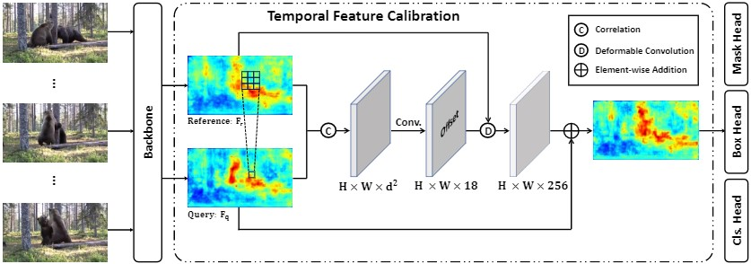
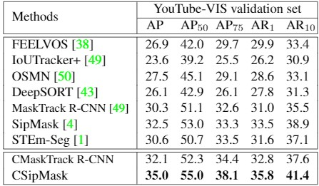

<head>
    
    
</head>

本文介绍一下我们最新提出的视频实例分割数据集OVIS，以及用于融合前后帧信息的TFC模块

**Occluded Video Instance Segmentation**

[[Paper]](https://arxiv.org/abs/2102.01558) &emsp; [[Project Page]](http://songbai.site/ovis/)

## 1. Motivation

对于被遮挡的物体，人类能够根据场景的前后变化来定位和追踪被遮挡的物体，并且能脑补出物体被遮住的部分，那么现有的深度学习方法对遮挡场景的处理能力如何呢？

为此，我们构建了一个针对强遮挡场景的大型视频实例分割数据集**O**ccluded **V**ideo **I**nstance **S**egmentation (**OVIS**)，它要求算法能检测、分割、跟踪视频里的所有物体。与其他数据集相比，OVIS最主要的特点就是视频里存在大量多种多样的遮挡。因此，OVIS很适合用来衡量算法对于遮挡场景的处理能力。

实验表明，现有的方法并不能在强遮挡场景下取得令人满意的结果。为了缓解遮挡带来的困难，我们提出了TFC模块，尝试通过融合前后帧信息来改善算法在遮挡场景下的表现。

## 2. Dataset Statistics 

<!--  -->

OVIS包含296k个高质量mask标注，25个常见类别，5,223个不同的物体，以及多种多样的遮挡场景。相比之前的Youtube-VIS数据集，OVIS拥有更多的mask，更多的物体。我们牺牲了一定的视频段数来标注更长更复杂的视频，以让它更具挑战性。

值得注意的是，除去上面提到的基础数据统计量，我们在视频/物体时长、每帧物体数、每段视频物体数等统计量上都有着很大的优势，也与实际场景更相近。此外，我们使用mBOR指标（详见论文）来粗略地反映数据集的遮挡严重程度，可以看出OVIS包含更多更严重的遮挡。

对于类别的选择，我们选取了25种人们熟知的类别，如上图。OVIS共包含4种交通工具、20种动物以及人。这些类别通常有较多的运动，也更容易产生严重的遮挡。此外，这些类别都可以在COCO、Pascal VOC中找到对应的图片数据，便于研究者们将OVIS与这些图片数据集共同训练以提升模型性能。

## 3. Visualization

<!--  -->

<table style="display:flex;justify-content:center;border:0" rules=none frame=void >
<tr>
<td>
</td>
<td>
</td>
</tr>
<tr>
<td>
</td>
<td>
</td>
</tr>
</table>

<i>Visualization of the annotations.</i>

OVIS中包含多种不同的遮挡类型，按遮挡程度可分为部分遮挡、完全遮挡，按被遮挡场景可分为被其他目标对象遮挡、被背景遮挡、被图片边界遮挡。不同类型的遮挡可能同时存在，物体之间的遮挡关系也比较复杂。

如上图右上角视频片段中，两只熊既互相部分遮挡，有时也会被树（背景）遮挡；右下角视频片段中，绿车和蓝车分别被白车和紫车逐渐遮挡，直到被完全遮挡，后来又逐渐出现在视线中。

此外，从上图左上角视频片段可以看出OVIS的标注质量很高，我们对笼子的网格、动物的毛发都做了精细的标注。

<!-- *更多可视化样例见文末* -->

## 4. Temporal Feature Calibration

OVIS中的目标物体通常是不断运动的，因此，某一帧被遮挡的物体可能在相邻的其他帧并没有被遮挡。人类可以利用这一点对被遮挡的物体进行追踪和判别，我们希望算法也可以做到利用前后帧信息来进行更好的检测和分类。

然而物体的运动也使得不同帧之间的特征在空间维度上并不能直接对齐。为了解决这一问题，我们提出了一个简单的模块 Temporal Feature Calibration (TFC)。

给定当前帧和相邻帧的特征$\textbf{F}\_\textbf{q}$和$\textbf{F}\_\textbf{r}$，TFC首先计算两帧之间的空间联系$\textbf{C}\in\mathbb{R}^{H\times W\times d^2}$，其中
$$\textbf{c}\textbf{(}\textbf{x}_\textbf{q},\textbf{x}_\textbf{r}\textbf{)} = \sum_{o\in[-k,k]\times[-k,k]}\textbf{F}_\textbf{q}(\textbf{x}_\textbf{q}+o)\textbf{F}_\textbf{r}(\textbf{x}_\textbf{r}+o)^\mathrm{T}$$
然后将$\textbf{C}$通过3层卷积得到相邻帧到当前帧的空间位置偏移$\textbf{D}\in\mathbb{R}^{H\times W\times 18}$，再通过Deformable Convolution根据$\textbf{D}$将相邻帧的特征$\textbf{F}\_\textbf{r}$与当前帧对齐，得到对齐后的特征$\overline{\textbf{F}}\_{\textbf{r}}$。最后将这个对齐后的特征$\overline{\textbf{F}}\_{\textbf{r}}$与当前帧的特征$\textbf{F}\_\textbf{q}$相加，来进行后面的分类、检测、分割等任务。

我们将TFC模块加到了MaskTrack R-CNN和SipMask上分别进行了尝试，改进后的模型可称为CMaskTrack R-CNN和CSipMask。

## 5. Experiments

我们尝试在OVIS上尝试了5种有开源代码的现有算法，结果如上表。可以看到OVIS是非常具有挑战性的，使用同样的评价指标，原本在Youtube-VIS上mAP能达到30+的sota方法，在OVIS上只有10+。5个现有算法中，STEm-Seg在OVIS上效果最好，但也只得到了14.4的mAP。CMaskTrack R-CNN和CSipMask分别在MaskTrack R-CNN和SipMask的基础上提升了2.6和2.9。

我们也在Youtube-VIS上测试了我们的新方法，CSipMask在SipMask的基础上提升了2.5个点，mAP达到了35.0。CMaskTrack R-CNN也比MaskTrack R-CNN高了1.8。

消融实验也表明，我们的TFC模块相比其他两种特征融合方式（直接相加融合，或者根据两个特征的差值计算offset再融合）都有明显提升。

## 6. Conclusion

我们针对遮挡场景下的视频实例分割任务贡献了一个大型数据集OVIS。作为继Youtube-VIS之后的第二个视频实例分割benchmark，OVIS主要设计用于衡量模型处理遮挡场景的能力。实验表明现有方法在OVIS上的表现远差于Youtube-VIS，因此，视觉模型对遮挡场景的理解还有很长的路要走。我们也尝试了利用相邻帧信息来缓解遮挡带来的影响，相比之前的方法有明显的提升。我们希望我们的工作能对遮挡问题的研究有所帮助。

*更多细节请见论文*

