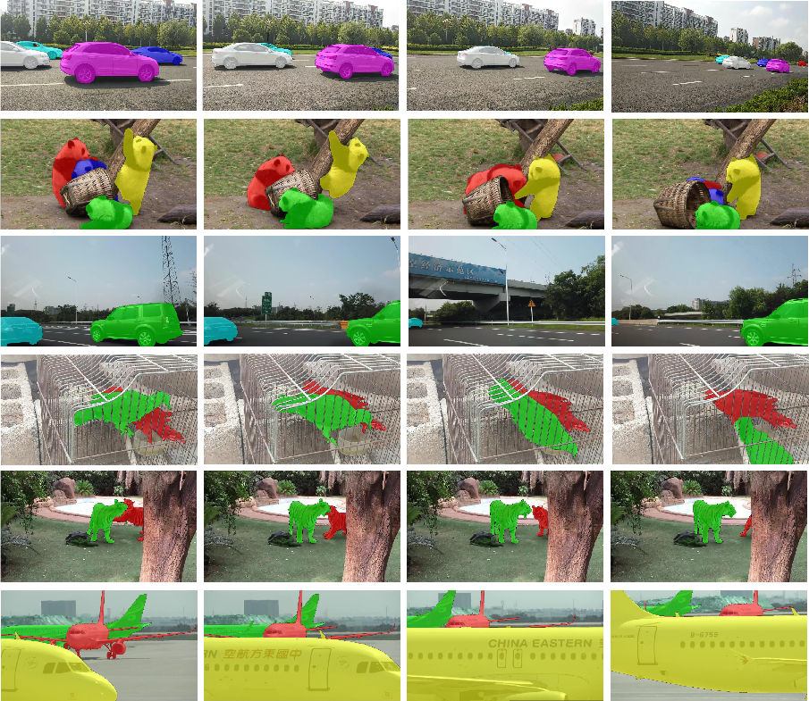
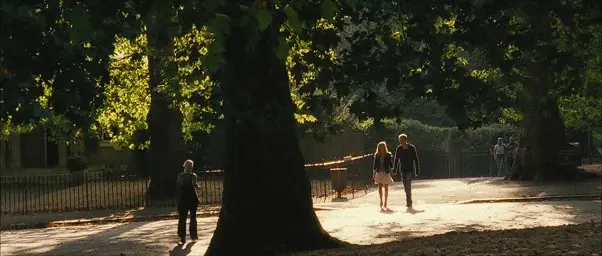
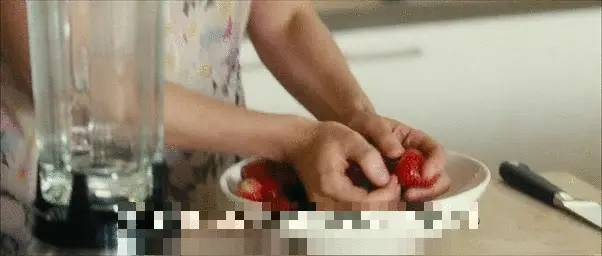
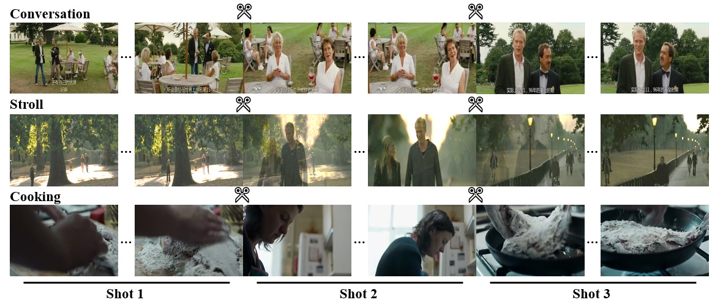

**OVIS** (short for **O**ccluded **V**ideo **I**nstance **S**egmentation) is a new large scale benchmark dataset for video instance segmentation task. It is designed with the philosophy of perceiving object occlusions in videos, which could reveal the complexity and the diversity of real-world scenes.

[Multi-shot Event Localization: a Benchmark](coming-soon) 
[Xiaolong Liu](https://github.com/xlliu7)1,2, [Song Bai](http://songbai.site)2,3, Fei Ding2, [Yao Hu](https://scholar.google.com/citations?user=LIu7k7wAAAAJ)2, [Xiang Bai](http://122.205.5.5:8071/~xbai/)1, [Philip H.S. Torr](http://www.robots.ox.ac.uk/~phst/)3 
1Huazhong University of Science and Technology
2Alibaba Group
3University of Oxford

<!-- [[Paper]](coming_soon)        [[Code]](coming_soon)         [[Download]](coming_soon) -->

---

# Abstract
Can our video understanding systems perceive objects when a heavy occlusion exists in a scene?  
To answer this question, we collect a large scale dataset called OVIS for occluded video instance segmentation, that is, to simultaneously detect, segment, and track instances in occluded scenes. OVIS consists of 151k high-quality instance masks from 25 semantic categories, where object occlusions usually occur. While our human vision systems can understand those occluded instances by contextual reasoning and association, our experiments suggest that current video understanding systems cannot. On the OVIS dataset, the highest AP achieved by state-of-the-art algorithms is only 14.3, which reveals that we are still at a nascent stage for understanding objects, instances, and videos in a real-world scenario. Moreover, to complement missing object cues caused by occlusion, we propose a plug-and-play module called temporal feature calibration. Built upon MaskTrack R-CNN and SipMask, we report an AP of 15.0 and 16.7 respectively, a remarkable improvement over the best-performing method. The OVIS dataset and the project code are released at [[link]](comming-soon).

---

# Explore MUSES

### OVIS Consists of:
- 151k high-quality instance masks
- 25 commonly seen semantic categories
- 280 videos with severe object occlusions
- 1,840 unique instances

Given a video, all the objects belonging to the pre-defined category set are exhaustively annotated. All the videos are annotated per 5 frames.

### Distinctive Properties

- **Severe occlusions.** The most distinctive property of our OVIS dataset is that it primarily collects videos, wherein objects are under various types of occlusions caused by different factors. The resulting mBOR is 0.23.
- **Long videos.** The average video duration and the average instance duration of OVIS are 19.02s and 14.22s respectively.
- **Crowded scenes.** On average, there are 6.57 instances per video and 5.10 objects per frame.

### Visualization

<!--  -->

<!-- <table style="display:flex;justify-content:center;border:0">
<tr>
<td>
<figcaption style="text-align:center;">Direct cut</figcaption></td>
<td>
<figcaption style="text-align:center;">Dissolve</figcaption></td>
</tr>
<tr>
<td>
<figcaption style="text-align:center;">Cut-in</figcaption></td>
<td>
<figcaption style="text-align:center;">Cut-out</figcaption></td>
</tr>
</table>

<i>Figure 1. Different types of shot cuts.</i>
 -->

<!-- <video width="320" height="240" controls>
  <source src="data/direct_cut.mp4" type="video/mp4">
</video> -->
<!-- ## Categories
The 25 categories are as follows -->

<!-- 

<i>Figure 2. Examples of multi-shot events. In each row, we show three consecutive shots in an instance and select two frames per shot for
illustration. The scissor icons indicate the shot boundaries.</i>
 -->

### Categories
The 25 semantic categories in OVIS are <i>Person, Bird, Cat, Dog, Horse, Sheep, Cow, Elephant, Bear, Zebra, Giraffe, Poultry, Giant panda, Lizard, Parrot, Monkey, Rabbit, Tiger, Fish, Turtle, Bicycle, Motorcycle, Airplane, Boat</i>, and <i>Vehicle</i>.

For a detailed description of OVIS, please refer to our paper.

----

# Download

### Dataset Download

We provide the frames and annotations.
- Frames: JPG format. The total size is 7.8GB. [[link]](/404.html)
- Annotations: JSON format. [[link]](/404.html)

The annotations are COCO-style, just like Youtube-VIS. So it's nearly cost-free to adapt your Youtube-VIS code for OVIS.

### Code

The code, models of the baseline method are released on [GitHub](https://github.com/qjy981010/OVIS).

The evaluation metric is the same as Youtube-VIS's, so you can use the evalution code provided by them [[link]](https://github.com/youtubevos/cocoapi)

<!-- # Wiki
In the production of movies and TV shows, multiple cameras are often used to shoot a scene at different positions. A continuous view filmed by one camera without interruption is called a **shot**. During editing, selected shots will be joined to depict a continous **event**. Transition from one shot to another is called a **cut**. -->

<!-- --- -->

<!-- # Other Info
Refer to [this page](https://www.utdallas.edu/atec/midori/Handouts/camera.htm#shot) for some knowledge about film making. -->

<!-- --- -->

# Contact
For questions and suggestions, please contact Jiyang Qi (jiyangqi at hust dot edu dot cn).

