<head>
    
    
</head>

本文介绍一下我们最新提出的视频实例分割数据集OVIS

**Occluded Video Instance Segmentation**

[[Paper]](https://arxiv.org/abs/2102.01558) &emsp; [[Project Page]](http://songbai.site/ovis/)

## 1. Motivation

对于被遮挡的物体，人类能够根据时序上下文来识别，定位和追踪被遮挡的物体，甚至能脑补出物体被遮住的部分，那么现有的深度学习方法对遮挡场景的处理能力如何呢？

为了探究这个问题，我们构建了一个针对强遮挡场景的大型视频实例分割数据集**O**ccluded **V**ideo **I**nstance **S**egmentation (**OVIS**)，视频实例分割（VIS）要求算法能检测、分割、跟踪视频里的所有物体。与现有的VIS数据集相比，OVIS最主要的特点就是视频里存在大量的多种多样的遮挡。因此，OVIS很适合用来衡量算法对于遮挡场景的处理能力。

实验表明，现有的方法并不能在强遮挡场景下取得令人满意的结果，相比于广泛使用的YouTube-VIS数据集，几乎所有算法的性能在OVIS上都下降了一半以上。

## 2. Dataset Statistics 

OVIS中的视频主要来自于优酷网站以及众包平台。我们一共采集了近万段视频，并最终从中挑选出了901段遮挡严重，运动较多、场景复杂的片段。我们要求每段视频都至少有两个相互遮挡的目标对象。其中大部分视频分辨率为1920x1080，时长在5s到60s之间。我们切除掉了部分视频中的字幕和logo，并按每5帧标注一帧的密度进行了高质量标注，最终得到了OVIS数据集。

我们选取了生活中常见的25类目标来构成OVIS数据集。如下图所示，OVIS中包含人，交通工具，以及动物，这些类别的目标往往处于运动状态，也更容易发生严重的遮挡。此外，OVIS的25个类别都可以在大型的图片级实例分割数据集(MS COCO，LVIS，Pascal VOC 等)中找到，方便研究人员进行模型的迁移和数据的复用。

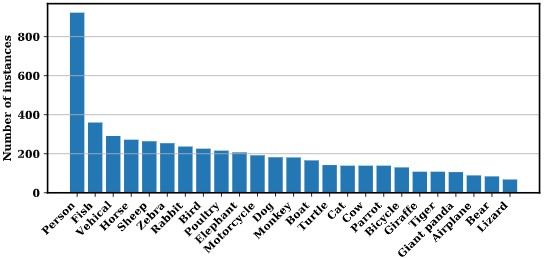

<!--  -->

OVIS包含5223个目标的296k个高质量mask标注。相比先前的Youtube-VIS数据集，OVIS拥有更多的mask和更多的目标。我们牺牲了一定的视频段数来标注更长更复杂的视频，以让它更具挑战性。

与先前的其他VIS数据集相比，OVIS最大的特点在于严重的遮挡。为了量化遮挡的严重程度，我们提出了一个指标mean Bounding-box Overlap Rate(mBOR)来粗略的反映遮挡程度。mBOR指图像中处于overlap状态下的目标像素占所有目标像素的比例。从下表中可以看出，相比于YouTube-VIS, OVIS有着更严重的遮挡。

值得注意的是，除去上面提到的基础数据统计量，OVIS在视频/物体时长、每帧物体数、每段视频物体数等统计量上都显著高于YouTube-VIS, 这进一步提高了OVIS的难度，同时也与实际场景更为相近。

<!-- 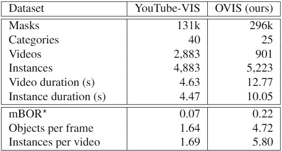 -->

## 3. Experiments

我们尝试在OVIS上尝试了5种有开源代码的现有算法，结果如下表。可以看到OVIS非常具有挑战性。使用同样的评价指标，MaskTrack R-CNN在Youtube-VIS验证集上mAP能达到30.3，在OVIS验证集上只有10.9；SipMask的mAP也从Youtube-VIS验证集上的32.5下降到了OVIS验证集上的10.3。5个现有算法中，STEm-Seg在OVIS上效果最好，但也只得到了13.8的验证集mAP。

<!-- 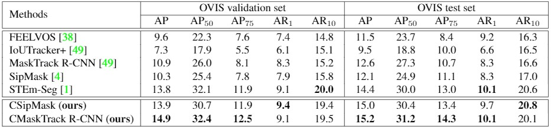 -->
<!-- 

 -->

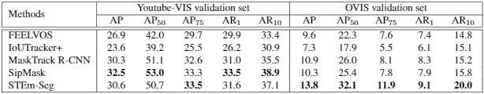

## 4. Visualization

OVIS中包含多种不同的遮挡类型，按遮挡程度可分为部分遮挡、完全遮挡，按被遮挡场景可分为被其他目标对象遮挡、被背景遮挡、被图片边界遮挡。不同类型的遮挡可能同时存在，物体之间的遮挡关系也比较复杂。

如下图第一行第二个视频片段中，两只熊既互相部分遮挡，有时也会被树（背景）遮挡；第一行第四个视频片段中，绿车和蓝车分别逐渐被白车和紫车完全遮挡，后来又逐渐出现在视野中。

此外，从下面的可视化片段中也可以看出OVIS的标注质量很高，我们对笼子的网格、动物的毛发都做了精细的标注。

<!-- 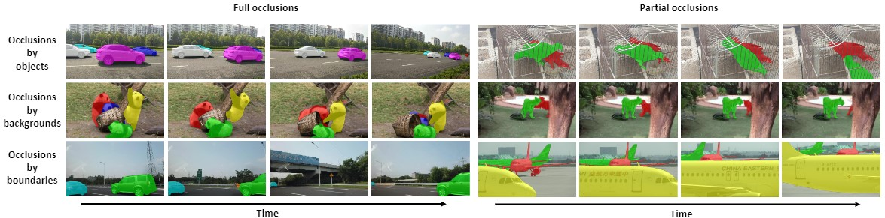 -->

<table style="display:flex;justify-content:center;border:0" rules=none frame=void >
<tr>
<td>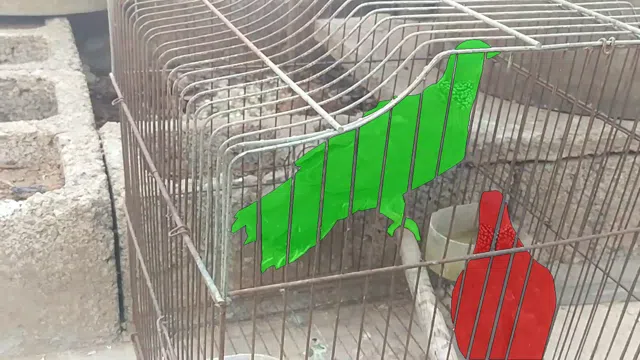
</td>
<td>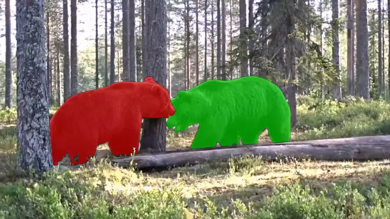
</td>
<td>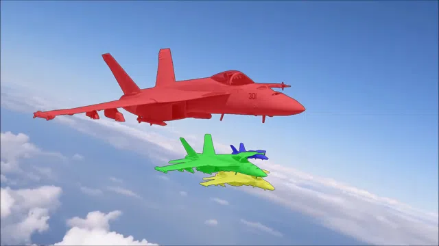
</td>
<td>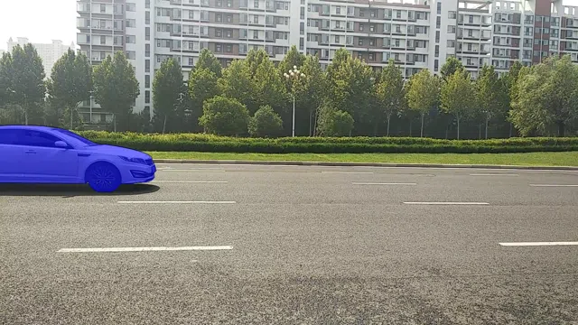
</td>
</tr>
<tr>
<td>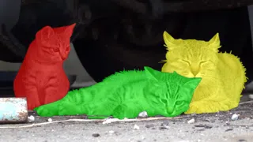
</td>
<td>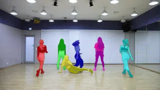
</td>
<td>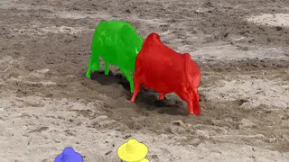
</td>
<td>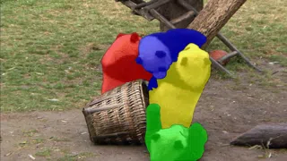
</td>
</tr>
<tr>
<td>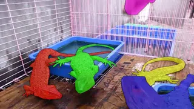
</td>
<td>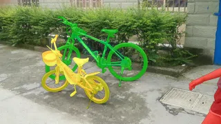
</td>
<td>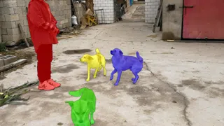
</td>
<td>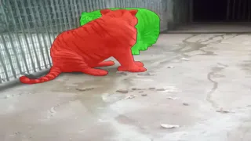
</td>
</tr>
<tr>
<td>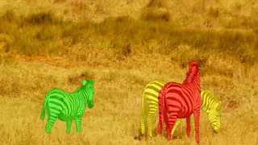
</td>
<td>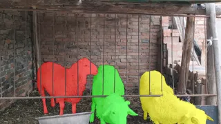
</td>
<td>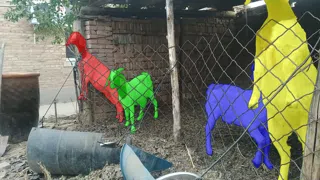
</td>
<td>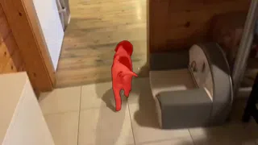
</td>
</tr>
</table>

<i>Visualization of the annotations.</i>

<!-- *更多可视化样例见文末* -->

## 5. Conclusion

我们针对遮挡场景下的视频实例分割任务构建了一个大型数据集OVIS。作为继YouTube-VIS之后的第二个视频实例分割benchmark，OVIS主要被设计用于衡量模型处理遮挡场景的能力。实验表明OVIS给现有算法带来了巨大的挑战。未来，我们还将把OVIS推广至视频物体分割（VOS), 视频全景分割(VPS)等场景，期待OVIS能够启发更多的研究人员进行复杂场景下视频理解的研究。

*更多细节请见论文*

<!-- <table style="display:flex;justify-content:center;border:0" rules=none frame=void >
<tr>
<td>
</td>
<td>
</td>
<td>
</td>
</tr>
<tr>
<td>
</td>
<td>
</td>
<td>
</td>
</tr>
<tr>
<td>
</td>
<td>
</td>
<td>
</td>
</tr>
<tr>
<td>
</td>
<td>
</td>
<td>
</td>
</tr>
</table>

<i>Visualization examples of the annotations.</i>
 -->

