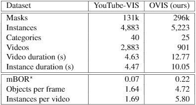

<head>
    
    
</head>

本文介绍一下我们最新提出的视频实例分割数据集OVIS

**Occluded Video Instance Segmentation**

[[Paper]](https://arxiv.org/abs/2102.01558) &emsp; [[Project Page]](http://songbai.site/ovis/)

## 1. Motivation

对于被遮挡的物体，人类能够根据场景的前后变化来定位和追踪被遮挡的物体，并且能脑补出物体被遮住的部分，那么现有的深度学习方法对遮挡场景的处理能力如何呢？

为此，我们构建了一个针对强遮挡场景的大型视频实例分割数据集**O**ccluded **V**ideo **I**nstance **S**egmentation (**OVIS**)，它要求算法能检测、分割、跟踪视频里的所有物体。与其他数据集相比，OVIS最主要的特点就是视频里存在大量多种多样的遮挡。因此，OVIS很适合用来衡量算法对于遮挡场景的处理能力。

实验表明，现有的方法并不能在强遮挡场景下取得令人满意的结果。

## 2. Dataset Statistics 

我们在优酷网站和众包平台上采集了近万段视频，从中挑选了901段遮挡和运动较多、场景较复杂的片段，每段视频都至少有两个相互遮挡的目标对象。其中大部分视频分辨率为1920x1080，时长在5s到60s之间。我们切除掉了部分视频中的字幕和logo，并按每5帧标注一帧的密度进行了高质量标注，最终得到了OVIS数据集。

<!--  -->

OVIS包含296k个高质量mask标注，25个常见类别，5,223个不同的物体，以及多种多样的遮挡场景。相比之前的Youtube-VIS数据集，OVIS拥有更多的mask，更多的物体。我们牺牲了一定的视频段数来标注更长更复杂的视频，以让它更具挑战性。

值得注意的是，除去上面提到的基础数据统计量，我们在视频/物体时长、每帧物体数、每段视频物体数等统计量上都有着很大的优势，也与实际场景更相近。此外，我们使用mBOR指标（详见论文）来粗略地反映数据集的遮挡严重程度，可以看出OVIS包含更多更严重的遮挡。

<!--  -->

对于类别的选择，我们选取了25种人们熟知的类别，如上图。OVIS共包含4种交通工具、20种动物以及人。这些类别通常有较多的运动，也更容易产生严重的遮挡。此外，这些类别都可以在COCO、Pascal VOC中找到对应的图片数据，便于研究者们将OVIS与这些图片数据集共同训练以提升模型性能。

## 3. Visualization

<!--  -->

<table style="display:flex;justify-content:center;border:0" rules=none frame=void >
<tr>
<td>
</td>
<td>
</td>
</tr>
<tr>
<td>
</td>
<td>
</td>
</tr>
</table>

<i>Visualization of the annotations.</i>

OVIS中包含多种不同的遮挡类型，按遮挡程度可分为部分遮挡、完全遮挡，按被遮挡场景可分为被其他目标对象遮挡、被背景遮挡、被图片边界遮挡。不同类型的遮挡可能同时存在，物体之间的遮挡关系也比较复杂。

如上图右上角视频片段中，两只熊既互相部分遮挡，有时也会被树（背景）遮挡；右下角视频片段中，绿车和蓝车分别被白车和紫车逐渐遮挡，直到被完全遮挡，后来又逐渐出现在视线中。

此外，从上图左上角视频片段可以看出OVIS的标注质量很高，我们对笼子的网格、动物的毛发都做了精细的标注。

*更多可视化样例见文末*

## 4. Experiments

<!--  -->

我们尝试在OVIS上尝试了5种有开源代码的现有算法，结果如上表。可以看到OVIS是非常具有挑战性的，使用同样的评价指标，原本在Youtube-VIS上mAP能达到30+的sota方法，在OVIS上只有10+。5个现有算法中，STEm-Seg在OVIS上效果最好，但也只得到了14.4的mAP。

## 5. Conclusion

我们针对遮挡场景下的视频实例分割任务贡献了一个大型数据集OVIS。作为继Youtube-VIS之后的第二个视频实例分割benchmark，OVIS主要设计用于衡量模型处理遮挡场景的能力。实验表明现有方法在OVIS上的表现远差于Youtube-VIS，因此，视觉模型对遮挡场景的理解还有很长的路要走。我们希望我们的工作能对遮挡问题的研究有所帮助。

*更多细节请见论文*

<table style="display:flex;justify-content:center;border:0" rules=none frame=void >
<tr>
<td>
</td>
<td>
</td>
<td>
</td>
</tr>
<tr>
<td>
</td>
<td>
</td>
<td>
</td>
</tr>
<tr>
<td>
</td>
<td>
</td>
<td>
</td>
</tr>
<tr>
<td>
</td>
<td>
</td>
<td>
</td>
</tr>
</table>

<i>Visualization examples of the annotations.</i>

